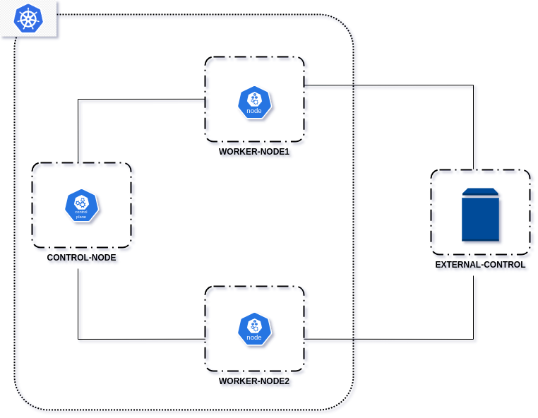

# Kubernetes

Kubernetes est une plateforme open source de gestion d'orchestration de conteneurs largement utilisée pour automatiser le déploiement, la mise à l'échelle et la gestion d'applications conteneurisées. Conçu à l'origine par Google et maintenant maintenu par la Cloud Native Computing Foundation (CNCF), Kubernetes fournit un environnement de déploiement robuste et flexible pour les applications modernes basées sur des conteneurs.

### Bac à sable

Nous mettons en place notre sandbox d'installation de kubernetes via l'utilitaire **vagrant** qui nous permettra d'installer :
- 3 machines virtuelles virtualbox **Rocky linux 8.9** pour notre cluster kubernetes : 1 noeud master et 2 noeuds worker
- 1 machine virtuelle virtualbox **Rocky linux 8.9** pour les services DNS et stockage NFS

<p align="center">

</p>

```
mkdir ~/kubernetes && cd ~/kubernetes
wget https://download.virtualbox.org/virtualbox/7.0.12/VBoxGuestAdditions_7.0.12.iso
```

```
vi Vagrantfile
```

```
# -*- mode: ruby -*-
# vi: set ft=ruby :

VAGRANTFILE_API_VERSION = "2"

Vagrant.configure(VAGRANTFILE_API_VERSION) do |config|
  config.vbguest.auto_update = false
  config.vbguest.no_remote = true
  config.vbguest.iso_path = "./VBoxGuestAdditions_7.0.12.iso"

  # General Vagrant VM configuration.
  config.vm.box = "willbrid/rockylinux8"
  config.vm.box_version = "0.0.2"
  config.ssh.insert_key = false
  config.vm.synced_folder ".", "/vagrant", disabled: true
  config.vm.provider :virtualbox do |v|
    v.memory = 4096
    v.cpus = 2
    v.linked_clone = true
  end

  # Master
  config.vm.define "control-node" do |srv|
    srv.vm.hostname = "control-node"
    srv.vm.network :private_network, ip: "192.168.56.200"
    srv.vm.provider :virtualbox do |v|
        v.memory = 2048
    end
  end

  # Worker1
  config.vm.define "worker-node1" do |srv|
    srv.vm.hostname = "worker-node1"
    srv.vm.network :private_network, ip: "192.168.56.201"
  end

  # Worker2
  config.vm.define "worker-node2" do |srv|
    srv.vm.hostname = "worker-node2"
    srv.vm.network :private_network, ip: "192.168.56.202"
  end

  # External-control
  config.vm.define "external-control" do |srv|
    srv.vm.hostname = "external-control"
    srv.vm.network :private_network, ip: "192.168.56.203"
  end
end
```

### Référence

- [Kubernetes Documentation](https://kubernetes.io/docs/home/)