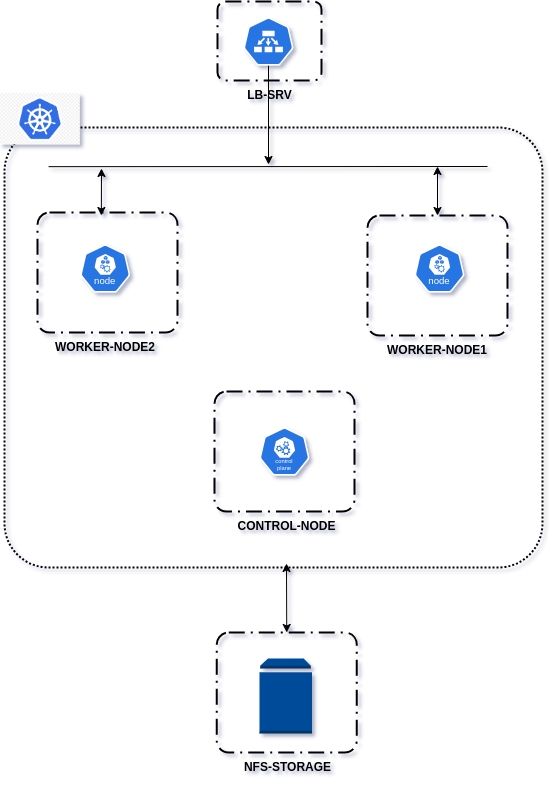

# Kubernetes

Kubernetes est une plateforme open source de gestion d'orchestration de conteneurs largement utilisée pour automatiser le déploiement, la mise à l'échelle et la gestion d'applications conteneurisées. Conçu à l'origine par Google et maintenant maintenu par la Cloud Native Computing Foundation (CNCF), Kubernetes fournit un environnement de déploiement robuste et flexible pour les applications modernes basées sur des conteneurs.

### Bac à sable

Nous mettons en place notre sandbox d'installation de kubernetes via l'utilitaire **vagrant** depuis une machine hôte **ubuntu 20.04**, qui nous permettra d'installer :
- 3 machines virtuelles virtualbox **Rocky linux 8.9** pour notre cluster kubernetes : 1 noeud master et 2 noeuds worker
- 1 machine virtuelle virtualbox **Rocky linux 8.9** pour le service de stockage NFS
- 1 machine virtuelle virtualbox **Rocky linux 8.9** pour le service haproxy (load balanceur) et dns

<p align="center">

</p>

```
mkdir ~/kubernetes && cd ~/kubernetes
wget https://download.virtualbox.org/virtualbox/7.0.12/VBoxGuestAdditions_7.0.12.iso
```

```
vi Vagrantfile
```

```
# -*- mode: ruby -*-
# vi: set ft=ruby :

VAGRANTFILE_API_VERSION = "2"

Vagrant.configure(VAGRANTFILE_API_VERSION) do |config|
  config.vbguest.auto_update = false
  config.vbguest.no_remote = true
  config.vbguest.iso_path = "./VBoxGuestAdditions_7.0.12.iso"

  # General Vagrant VM configuration.
  config.vm.box = "willbrid/rockylinux8"
  config.vm.box_version = "0.0.2"
  config.ssh.insert_key = false
  config.vm.synced_folder ".", "/vagrant", disabled: true
  config.vm.provider :virtualbox do |v|
    v.memory = 4096
    v.cpus = 2
    v.linked_clone = true
  end
  
  config.trigger.before :up do |trigger|
    trigger.info = "Creating the shared directory at the root directory of Vagrantfile"
    trigger.run = {inline: "bash -c 'mkdir -p $(pwd)/shared'"}
  end
  config.vm.synced_folder "shared/", "/home/vagrant/shared"

  config.vm.provision "shell", inline: <<-SHELL, privileged: true
    if ! command -v git &> /dev/null; then
        echo "Git is not installed, installation in progress..."
        dnf install -y git
    fi
  SHELL

  # Master
  config.vm.define "control-node" do |srv|
    srv.vm.hostname = "control"
    srv.vm.network :private_network, ip: "192.168.56.200"
  end

  # Worker1
  config.vm.define "worker-node1" do |srv|
    srv.vm.hostname = "worker1"
    srv.vm.network :private_network, ip: "192.168.56.201"
  end

  # Worker2
  config.vm.define "worker-node2" do |srv|
    srv.vm.hostname = "worker2"
    srv.vm.network :private_network, ip: "192.168.56.202"
  end

  # NFS-Storage
  config.vm.define "nfs-storage" do |srv|
    srv.vm.hostname = "nfs-storage"
    srv.vm.network :private_network, ip: "192.168.56.203"
    srv.vm.disk :disk, name: "storage", size: "100GB"
    srv.vm.provider :virtualbox do |v|
        v.memory = 2048
    end
  end

  # LB-SRV
  config.vm.define "lb-srv" do |srv|
    srv.vm.hostname = "lb-srv"
    srv.vm.network :private_network, ip: "192.168.56.204"
    srv.vm.provider :virtualbox do |v|
        v.memory = 2048
        v.cpus = 1
    end
  end
end
```

### Installation de k8s version 1.27

- Pour tous les 3 noeuds


```
git clone https://github.com/willbrid/DevSecOps-SRE-infra.git
```

```
cd DevSecOps-SRE-infra/kubernetes/script-bash
```

```
chmod +x common-setup.sh
```

--- Noeud master

```
sudo ./common-setup.sh --hostname=control --hostfile=hosts --k8s-version=1.27.0
```

--- Noeud worker1

```
sudo ./common-setup.sh --hostname=worker1 --hostfile=hosts --k8s-version=1.27.0
```

--- Noeud worker2

```
sudo ./common-setup.sh --hostname=worker2 --hostfile=hosts --k8s-version=1.27.0
```

- Sur le noeud master

```
chmod +x master-setup.sh
```

```
sudo ./master-setup.sh --api-server-ip=192.168.56.200
```

- Sur tous les noeuds workers

```
chmod +x worker-setup.sh
```

```
sudo ./worker-setup.sh
```

### Installation du service NFS sur le serveur nfs-storage

```
git clone https://github.com/willbrid/DevSecOps-SRE-infra.git
```

```
cd DevSecOps-SRE-infra/kubernetes/script-bash
```

```
chmod +x nfs-server-setup.sh
```

```
sudo ./nfs-server-setup.sh --nfs-network=192.168.56.0/24 --device-name=sdb --device-num=1 --device-size=100
```

### Installation du provisionneur de volume persistant dans notre cluster depuis notre noeud master

```
sudo su
```

- Installation de Helm

```
curl -fsSL -o get_helm.sh https://raw.githubusercontent.com/helm/helm/main/scripts/get-helm-3
```

```
chmod +x get_helm.sh
```

```
./get_helm.sh
```

```
helm version
```

- Installation du provisionneur

```
helm repo add nfs-subdir-external-provisioner https://kubernetes-sigs.github.io/nfs-subdir-external-provisioner
```

```
helm install nfs-subdir-external-provisioner \
nfs-subdir-external-provisioner/nfs-subdir-external-provisioner \
--set nfs.server=192.168.56.203 \
--set nfs.path=/data/nfsshared \
--set storageClass.onDelete=true
```

La classe de stockage dynamique NFS a été installée et porte le nom de **nfs-client**.

### Installation du controlleur ingress nginx depuis notre noeud master

- Récupération des manifests controlleur ingress nginx

```
git clone https://github.com/techiescamp/nginx-ingress-controller
```

```
cd nginx-ingress-controller/manifests
```

- Configuration du déploiement à 2 instances afin qu'elles soient déployées chacune sur chaque noeud worker

```
vi deployment.yaml
```

```
...
spec:
  replicas: 2
...
```

- Configuration de l'adresse du load balanceur sur le service **ingress-nginx-controller** dans le fichier **services.yaml**

```
vi services.yaml
```

```
apiVersion: v1
kind: Service
metadata:
  labels:
    app.kubernetes.io/component: controller
    app.kubernetes.io/instance: ingress-nginx
    app.kubernetes.io/name: ingress-nginx
    app.kubernetes.io/part-of: ingress-nginx
    app.kubernetes.io/version: 1.9.4
  name: ingress-nginx-controller
  namespace: ingress-nginx
spec:
  externalIPs:
  - 192.168.56.204
...
```

- Déploiement du controlleur ingress nginx

```
kubectl apply -f .
```

- Vérification de l'installation du controlleur ingress nginx

```
kubectl get deployment -n ingress-nginx
```

```
kubectl get pods -n ingress-nginx
```

```
kubectl get svc -n ingress-nginx
```

### Mise en place d'un load balanceur Haproxy depuis notre noeud lb-srv

- Installation de notre load balanceur Haproxy (version 2.8.9)

```
git clone https://github.com/willbrid/DevSecOps-SRE-infra.git
```

```
cd DevSecOps-SRE-infra/kubernetes/script-bash
```

```
chmod +x haproxy-setup.sh
```

```
sudo ./haproxy-setup.sh --version=2.8.9
```

- Configuration du load balanceur

```
sudo vi /etc/haproxy/haproxy.cfg 
```

```
...
...
# Frontend pour http dans tcp
frontend http_in_tcp
  bind *:80
  default_backend http-server

# Backend pour http dans tcp
backend http-server
  mode tcp
  balance roundrobin
  server http-server-worker1 192.168.56.201:30897 check
  server http-server-worker2 192.168.56.202:30897 check

# Frontend pour https dans tcp
frontend https_in_tcp
  bind *:443
  default_backend https-server

# Backend pour https dans tcp
backend https-server
  mode tcp
  balance roundrobin
  server https-server-worker1 192.168.56.201:32374 check
  server https-server-worker2 192.168.56.202:32374 check
```

Les ports **30897** et **32374** sont respectivement les ports du service **ingress-nginx-controller** de type **LoadBalancer** qui correspondent respectivement au port **80** et **443** de **nginx** du deploiement **ingress-nginx-controller**.

Nous pouvons vérifier que notre fichier de configuration est correcte.

```
/usr/local/sbin/haproxy -c -f /etc/haproxy/haproxy.cfg
```

Nous autorisons les ports **80** et **443** depuis **firewalld**

```
sudo firewall-cmd --permanent --add-port=80/tcp --add-port=443/tcp
sudo firewall-cmd --reload
```

Nous redémarrons et vérifions le statut du service haproxy

```
sudo systemctl restart haproxy
sudo systemctl status haproxy
```

### Référence

- [Kubernetes Documentation](https://kubernetes.io/docs/home/)
- [Devopscube setup ingress nginx controller](https://devopscube.com/setup-ingress-kubernetes-nginx-controller/)